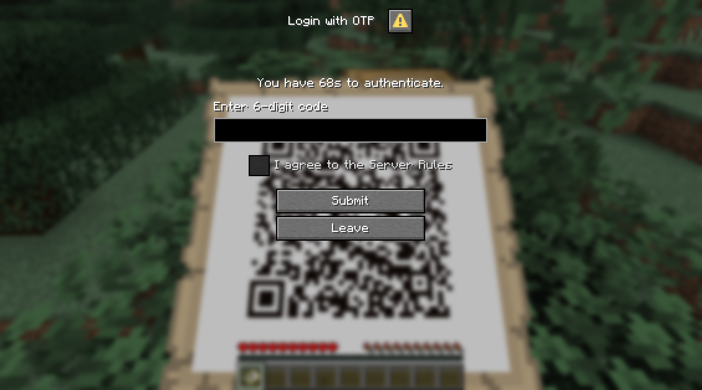

# 2FAdialog
A modern Bukkit/Paper plugin that enables Two-Factor Authentication (2FA) on your Minecraft server using the new [Dialog](https://minecraft.wiki/w/Dialog) windows introduced in Minecraft 1.21.6.

Instead of chat commands or anvil-based GUIs, players authenticate through native dialog panels for a smooth, intuitive flow.

[SpigotMC](https://www.spigotmc.org/resources/2fa-dialog.128078/)

## Features

- **TOTP authentication** - compatible with popular authenticator apps (Google Authenticator, Microsoft Authenticator, etc.)

- **Native Dialog UI** - no chat spam, no clunky custom GUIs.

- **User-friendly setup** - QR code map for registration + dialog input for codes.

- **Vanish-friendly** - works with popular vanish plugins (SuperVanish, EssentialsX, etc.).

- **Storage** - YAML (default) and MySQL (planned).

- **Trusted sessions** - auto-login when a player rejoins from the same IP within a configurable window.

- **Attempt limiting & timeouts** - configurable attempt limits and timeouts.

- **Fully configurable** - custom messages and auth settings in `config.yml`.


## Compatibility

- Minecraft **1.21.7** or higher. Fully tested on **PaperMC 1.21.8**. 

- Java **21+**

More details please see [PaperMC docs](https://docs.papermc.io/paper/dev/dialogs/).

## Installation

1. Download the plugin JAR from [Releases](https://github.com/forkthus/2FAdialog/releases/)

2. Drop it into `plugins/` and restart the server.

3. A default config will be created at `plugins/TwoFADialog/config.yml`.

4. Configure messages and authentication settings

5. Restart or run `/2fa reload` in game.

## Commands
- Reset a player's key

  `/2fa remove <player>`

- Reload the config

  `/2fa reload`

## Permissions
```
twofadialog.admin:
  description: Allows use of 2FA admin commands
  default: op
```

## Config
Default config at `plugins/TwoFADialog/config.yml`

```yaml
# TwoFADialog Configuration
# This plugin provides 2FA authentication using TOTP codes

# Authentication settings
auth:
  # Time window for TOTP codes (in 30-second intervals)
  time-window: 1
  
  # How long (in days) same IP bypass lasts before requiring 2FA again
  ip-bypass-days: 7
  
  # Delay in seconds before asking if user finished scanning QR code
  scan-ask-delay: 10
  
  # Timeout for registration process (in seconds)
  registration-timeout: 90
  
  # Timeout for login process (in seconds)  
  login-timeout: 30
  
  # Maximum failed login attempts before temporary ban (0 = disabled)
  max-failed-attempts: 3
  
  # Ban duration in minutes after max failed attempts
  failed-attempt-ban-minutes: 5
  
  # Server name shown in authenticator apps (e.g. "My Minecraft Server")
  server-name: "My Minecraft Server"

# Dialog messages - customize all text shown to players
messages:
  # Scan prompt dialog
  scan-prompt:
    title: "Two-Factor Setup"
    body: "Hey! You need to scan the QR code on a map to continue.\nYou have %time-left%s to complete setup."
    button-text: "Give me the QR map"
    button-description: "You'll receive a map to scan with your phone."
    exit-button: "Leave Server"
    exit-description: "Quit the server."
    
  # Ask if finished scanning dialog
  ask-finished:
    title: "Finished scanning?"
    body: "Have you scanned and added the account in your Authenticator app?\nYou have %time-left%s to complete setup."
    yes-button: "Yes, continue"
    yes-description: "Go to OTP login."
    no-button: "Not yet"
    no-description: "I'll keep scanning."
    
  # Login with OTP dialog
  login:
    title: "Login with OTP"
    body: "You have %time-left%s to authenticate."
    otp-field-label: "Enter 6-digit code"
    rules-field-label: "I agree to the Server Rules"
    submit-button: "Submit"
    submit-description: "Validate and enter."
    leave-button: "Leave"
    leave-description: "Quit the server."
    
  # In-game messages
  game:
    qr-received: "You received a QR map. Scan it with your Authenticator app."
    auth-success: "2FA passed. Welcome!"
    join-message: "%player% joined the game"
    leave-kick: "You chose to leave the server."
    admin-reset-kick: "Your 2FA data has been reset by an administrator. Please rejoin to set up 2FA again."
    
  # Error messages
  errors:
    no-input: "No input received. Try again."
    must-agree-rules: "You must agree to the Server Rules to enter."
    wrong-code: "Wrong code. Please try again. (%attempts-left% attempts remaining)"
    wrong-code-banned: "Too many failed attempts. You are temporarily banned for %ban-time% minutes."
    no-chat: "You cannot chat during authentication."
    no-drop-map: "You cannot drop the QR map during authentication."
    finish-login: "You must finish login first."
    timeout-expired: "Authentication timeout expired. Please rejoin to try again."
    
  # Admin command messages
  admin:
    no-permission: "You don't have permission to use this command."
    usage: "Usage: /2fa <remove|reload> [player]"
    player-not-found: "Player '%player%' not found."
    player-reset: "Removed 2FA data for player '%player%'. They will need to set up 2FA again on next login."
    config-reloaded: "Configuration reloaded successfully!"
    config-reload-error: "Error reloading configuration: %error%"```

